# django-rest-framework-12th
 
## 2주차 과제

### 서비스 설명
- 수강편람 - 수업 정보, 수강신청 결과 제공
- 마일리지 컷 - 과목명, 담당 교수를 입력하면 사용자 정보에 기록된 전공과 학년을 기준으로 최근 3개년 마일리지 컷 제공

### 모델 설명
```python
class Lecture(models.Model):
    professor = models.ForeignKey('Professor', on_delete=models.CASCADE, related_name='lectures', verbose_name='담당교수')
    code = models.CharField('학정번호', max_length=30)
    faculty = models.CharField('학부대학', max_length=30)
    department = models.CharField('전공', max_length=30)
    semester = models.CharField('학기', max_length=30)
    grade = models.IntegerField('학년')
    name = models.CharField('교과목명', max_length=30)
    credit = models.IntegerField('학점')
    classroom = models.CharField('강의실', max_length=50)
    time = models.CharField('강의시간', max_length=50)

    def __str__(self):
        return self.name
```
```python
class Professor(models.Model):
    name = models.CharField('이름', max_length=30)
    department = models.CharField('소속', max_length=30, null=True, blank=True)
    office = models.CharField('연구실', max_length=30, null=True, blank=True)
    phone = models.CharField('연락처', max_length=30, null=True, blank=True)
    email = models.EmailField('이메일', null=True, blank=True)

    def __str__(self):
        return self.name
```
```python
class Rank(models.Model):
    lecture = models.ForeignKey('Lecture', on_delete=models.CASCADE, related_name='ranks', verbose_name='과목')
    mileage = models.IntegerField('마일리지')
    is_major = models.BooleanField('전공 여부')
    is_included = models.BooleanField('전공자 정원 포함 여부')
    grade = models.IntegerField('학년')
    success = models.BooleanField('수강 여부')
```
```python
class Result(models.Model):
    lecture = models.OneToOneField('Lecture', on_delete=models.CASCADE, verbose_name='과목')
    quota = models.IntegerField('정원')
    participants = models.IntegerField('참여 인원')
    major_quota = models.IntegerField('전공자 정원')
    include_second_major = models.BooleanField('복수전공 포함 여부')
    max_mileage = models.IntegerField('최대 마일리지')
```
```python
class Profile(models.Model):
    user = models.OneToOneField(User, on_delete=models.CASCADE)
    lectures = models.ManyToManyField(Lecture, related_name='users')
    student_id = models.IntegerField('학번', unique=True)
    major = models.CharField('전공', max_length=30, choices=MAJOR_CHOICES)
    second_major = models.CharField('복수전공', max_length=30, null=True, blank=True, choices=MAJOR_CHOICES)
    grade = models.IntegerField('학년')
```

### ORM 적용해보기
1. 데이터베이스에 해당 모델 객체 3개 넣기
```python
>>> from api.models import Lecture, Professor

>>> q = Professor(name="이인권", department="공과대학 컴퓨터과학과", office="제4공학관 D719", phone="02-2123-5713", email="iklee@yonsei.ac.kr")
>>> q.save()
>>> w = Professor(name="안형찬", department="공과대학 컴퓨터과학과")
>>> w.save()
>>> a = Lecture(code="CSI2102-02", faculty="공과대학", department="컴퓨터과학전공", semester="2020-2", grade=1, name="객체지향프로그래밍", credit=3, classroom="동영상컨텐츠/실시간온라인", time="화8,9/목9")
>>> a.professor = q
>>> a.save()
>>> b = Lecture(code="CSI3108-01", faculty="공과대학", department="컴퓨터과학전공", semester="2020-2", grade=3, name="알고리즘분석", credit=3, classroom="공D504", time="수2/금5,6")
>>> b.professor = w
>>> b.save()
>>> w.lectures.create(code="CSI2103-02", faculty="공과대학", department="컴퓨터과학전공", semester="2020-1", grade=3, name="자료구조", credit=3, classroom="공D504", time="화4/목6,7")
# Lecture.objects.create(professor=w, ~)도 같은거
```
2. 삽입한 객체들을 쿼리셋으로 조회해보기
```python
>>> Lecture.objects.all()
<QuerySet [<Lecture: 객체지향프로그래밍, 이인권>, <Lecture: 자료구조, 안형찬>, <Lecture: 알고리즘분석, 안형찬>]>
>>> Professor.objects.all()
<QuerySet [<Professor: 이인권, 공과대학 컴퓨터과학과>, <Professor: 안형찬, 공과대학 컴퓨터과학과>]>
>>> b = Professor.objects.get(name="안형찬")
>>> b.lectures.all()
<QuerySet [<Lecture: 자료구조, 안형찬>, <Lecture: 알고리즘분석, 안형찬>]>
```
3. filter 함수 사용해보기
```python
>>> Lecture.objects.filter(semester="2020-2")
<QuerySet [<Lecture: 객체지향프로그래밍, 이인권>, <Lecture: 알고리즘분석, 안형찬>]>
```

### 간단한 회고 
실제로 내가 필요로 하는 서비스를 만드는 것이라 흥미롭게 진행할 수 있었다.   
실제 데이터를 삽입하면서 내가 설정한 조건에 맞지 않는 데이터가 존재하여 모델을 수정하고 migration을 계속 추가하여 초기 설계를 신경써서 해야겠다는 생각을 했다.   
중간중간 커밋하자..


## 3주차 과제

### 모델 선택 및 데이터 삽입
```python
class Lecture(models.Model):
    professor = models.ForeignKey('Professor', on_delete=models.CASCADE, related_name='lectures', verbose_name='담당교수')
    code = models.CharField('학정번호', max_length=30)
    faculty = models.CharField('학부대학', max_length=30)
    department = models.CharField('전공', max_length=30)
    semester = models.CharField('학기', max_length=30)
    grade = models.IntegerField('학년')
    name = models.CharField('교과목명', max_length=30)
    credit = models.IntegerField('학점')
    classroom = models.CharField('강의실', max_length=50)
    time = models.CharField('강의시간', max_length=50)

    def __str__(self):
        return "{}, {}".format(self.name, self.professor.name)


class Professor(models.Model):
    name = models.CharField('이름', max_length=30)
    department = models.CharField('소속', max_length=30, null=True, blank=True)
    office = models.CharField('연구실', max_length=30, null=True, blank=True)
    phone = models.CharField('연락처', max_length=30, null=True, blank=True)
    email = models.EmailField('이메일', null=True, blank=True)

    def __str__(self):
        return "{}, {}".format(self.name, self.department)
```
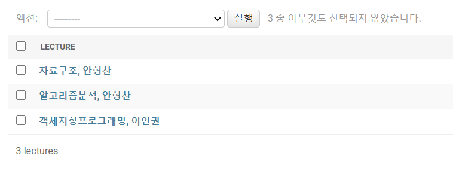

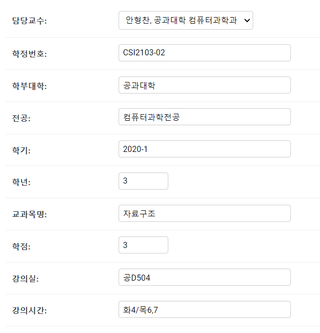

### 모든 list를 가져오는 API
- URL: api/lectures/
- Method: GET
```python
[
    {
        "id": 1,
        "code": "CSI2102-02",
        "faculty": "공과대학",
        "department": "컴퓨터과학전공",
        "semester": "2020-2",
        "grade": 1,
        "name": "객체지향프로그래밍",
        "credit": 3,
        "classroom": "동영상컨텐츠/실시간온라인",
        "time": "화8,9/목9",
        "professor": 1
    },
    {
        "id": 2,
        "code": "CSI3108-01",
        "faculty": "공과대학",
        "department": "컴퓨터과학전공",
        "semester": "2020-2",
        "grade": 3,
        "name": "알고리즘분석",
        "credit": 3,
        "classroom": "공D504",
        "time": "수2/금5,6",
        "professor": 2
    },
    {
        "id": 3,
        "code": "CSI2103-02",
        "faculty": "공과대학",
        "department": "컴퓨터과학전공",
        "semester": "2020-1",
        "grade": 3,
        "name": "자료구조",
        "credit": 3,
        "classroom": "공D504",
        "time": "화4/목6,7",
        "professor": 2
    }
]
```

### 특정한 데이터를 가져오는 API
- URL: api/lectures/1/
- Method: GET
```python
{
    "id": 1,
    "code": "CSI2102-02",
    "faculty": "공과대학",
    "department": "컴퓨터과학전공",
    "semester": "2020-2",
    "grade": 1,
    "name": "객체지향프로그래밍",
    "credit": 3,
    "classroom": "동영상컨텐츠/실시간온라인",
    "time": "화8,9/목9",
    "professor": 1
}
```

### 새로운 데이터를 create하도록 요청하는 API
- URL: api/lectures/
- Method: POST
- Body: {
        "code": "CSI2102-01",
        "faculty": "공과대학",
        "department": "컴퓨터과학전공",
        "semester": "2019-2",
        "grade": 1,
        "name": "객체지향프로그래밍",
        "credit": 3,
        "classroom": "I진D114",
        "time": "화7,8,9",
        "professor": 1
    }
```python
{
    "id": 4,
    "code": "CSI2102-01",
    "faculty": "공과대학",
    "department": "컴퓨터과학전공",
    "semester": "2019-2",
    "grade": 1,
    "name": "객체지향프로그래밍",
    "credit": 3,
    "classroom": "I진D114",
    "time": "화7,8,9",
    "professor": 1
}
```

### 특정 데이터를 삭제 또는 업데이트하는 API
- URL: api/lectures/4/
- Method: PUT
- Body: {
        "code": "CSI2102-02",
        "faculty": "공과대학",
        "department": "컴퓨터과학전공",
        "semester": "2019-2",
        "grade": 1,
        "name": "객체지향프로그래밍",
        "credit": 3,
        "classroom": "I진D114",
        "time": "화7,8,9",
        "professor": 1
    }
```python
{
    "id": 4,
    "code": "CSI2102-02",
    "faculty": "공과대학",
    "department": "컴퓨터과학전공",
    "semester": "2019-2",
    "grade": 1,
    "name": "객체지향프로그래밍",
    "credit": 3,
    "classroom": "I진D114",
    "time": "화7,8,9",
    "professor": 1
}
```
- URL: api/lectures/4/
- Method: DELETE
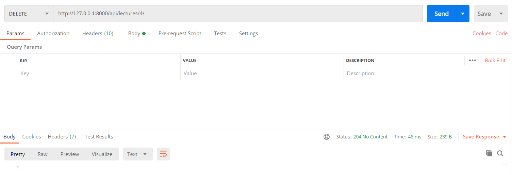

### 공부한 내용 정리
Views   
- FBV(Function Based Views)
- CBV(Class Based Views)   
HTTP 메소드를 if가 아닌 함수명으로 처리

REST(Representational State Transfer)
- uri을 통해 정보의 자원 표현 -> 고유한 주소로 식별(identifier)
- 자원에 대한 행위(CRUD)는 HTTP 메소드를 통해 표현(header)
- 클라이언트가 자원의 상태를 조작하기 위해 uri와 method를 포함한 요청을 보내면, 
서버는 응답으로 자원을 JSON, XML과 같은 형태로 표현(Representation)하여 전송(body)

REST API 규칙 -> RESTful
- uri에는 명사, 소문자 사용 -> HTTP 메소드와 분리
- /로 계층 관계 표현, 마지막에 포함 x
- _대신 - 사용
- 파일 확장자는 uri에 포함 x -> Accept Header 이용
- Collection은 복수, Document는 단수로 사용

Serializer
- 복잡한 데이터를 native python 자료형으로 변환해줌
- 클라이언트 요청 -> queryset, 모델 인스턴스 -> native python 자료형 -> json, xml 반환 

Content Type
- 요청, 응답 헤더에 포함
- 컨텐츠 타입(MIME)와 문자열 인코딩 명시

Accept Header
- 요청 헤더에 포함
- 클라이언트가 허용할 수 있는 파일 형식(MIME) 명시 -> 처리할 응답 형식 선언

Format suffix
- 처리할 응답 파일 형식을 url에 추가

Query parameter format
- 파일 형식을 query string으로 전송

### 간단한 회고 
자체 템플릿 ㄷㄷ
dumpdata, loaddata

## 4주차 과제

### Viewset

### url 매핑
```python
urls.py

router = routers.DefaultRouter()
router.register(r'lectures', LectureViewSet)  # r: raw string(\도 그대로 출력)
router.register(r'profiles', ProfileViewSet)

urlpatterns = router.urls
```
자동으로 2개의 url 생성
- List - list, create -> url: lectures/ name: 'lecture-list'
- Detail - retrieve, update, destroy -> url: lectures/{pk}/ name: 'lecture-detail'
- prefix = lectures, basename = lecture

### action 추가
```python
@action(methods=['post'], detail=False, url_path='method', url_name='method')
```
- methods: http method(default는 get)
- detail: list인지 detail인지
- url_path: lectures/method (default는 함수 이름)
- url_name: 'lecture-method' (default는 함수 이름 _ -> -)

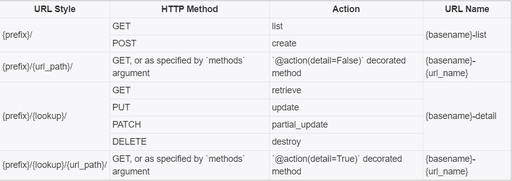

```python
views.py

class LectureViewSet(viewsets.ModelViewSet):
    serializer_class = LectureSerializer
    queryset = Lecture.objects.all()

    @action(methods=['get'], detail=False, url_path='lecture-filter')  # detail: list인지 detail인지
    def lecture_filter(self, request):  # 입력을 query string으로 받음
        lecture_name = request.query_params.get('name')
        # request.GET도 가능, request.data[~]는 body에 담긴 data 접근(POST)
        if lecture_name is not None:
            lectures = Lecture.objects.filter(name__icontains=lecture_name).order_by('grade')
            # __icontains: 대소문자 구분 없이 포함 여부 확인
            # filter(~__gt=~): greater than, lt(less than), gte(greater than equal), lte
            serializer = LectureSerializer(lectures, many=True)
            return Response(serializer.data)
        return Response("검색 결과가 없습니다.")
```
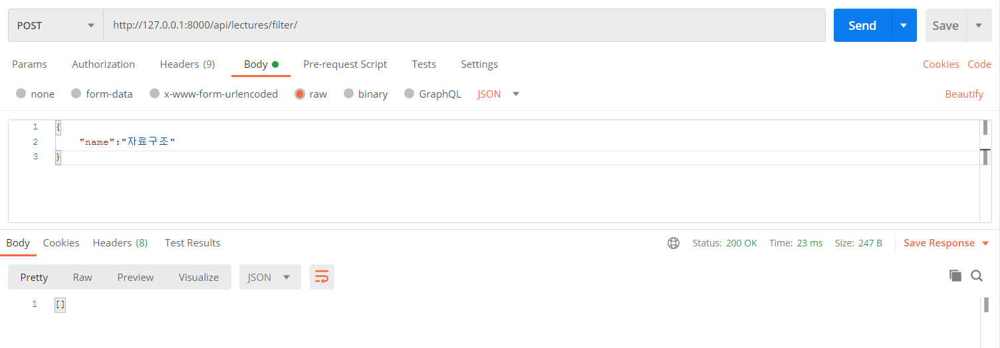

```python
    @action(detail=True)
    def result(self, request, pk):
        lecture = get_object_or_404(Lecture, pk=pk)
        result = lecture.result
        serializer = ResultSerializer(result)
        return Response(serializer.data)
```


```python
    @action(detail=True)
    def rank(self, request, pk):
        lecture = get_object_or_404(Lecture, pk=pk)
        ranks = lecture.ranks.all().order_by('-mileage', 'grade')
        serializer = RankSerializer(ranks, many=True)
        return Response(serializer.data)
```
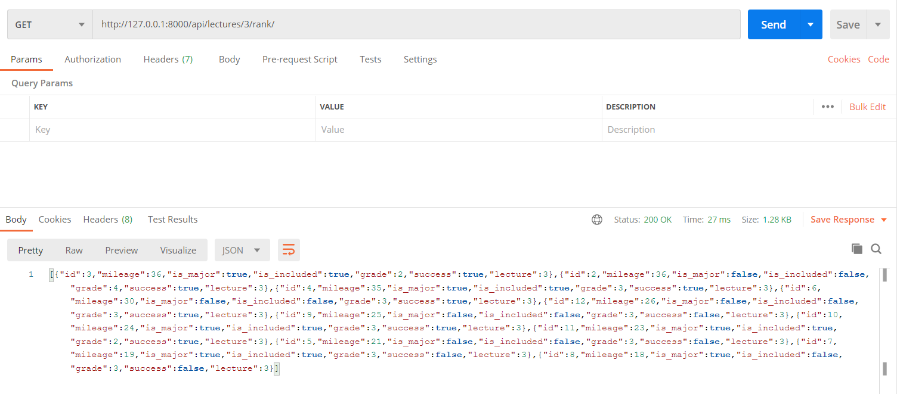

```python
class ProfileViewSet(viewsets.ModelViewSet):
    serializer_class = ProfileSerializer
    queryset = Profile.objects.all()

    @action(detail=True, url_path='mileage-cut')
    def mileage_cut(self, request, pk):
        mileage_cut = {}
        user = get_object_or_404(Profile, pk=pk)
        for lecture in user.lectures.all():
            if lecture.result.include_second_major:
                if user.major == lecture.department or user.second_major == lecture.department:
                    mileage_cut[lecture.name] = lecture.ranks.filter(is_included=True, grade=user.grade, success=True
                                                                     ).order_by('mileage')[0].mileage
                else:
                    mileage_cut[lecture.name] = lecture.ranks.filter(is_included=False, grade=user.grade, success=True
                                                                     ).order_by('mileage')[0].mileage
            else:
                if user.major == lecture.department:
                    mileage_cut[lecture.name] = lecture.ranks.filter(is_included=True, grade=user.grade, success=True
                                                                     ).order_by('mileage')[0].mileage
                else:
                    mileage_cut[lecture.name] = lecture.ranks.filter(is_included=False, grade=user.grade, success=True
                                                                     ).order_by('mileage')[0].mileage
        return Response(mileage_cut)
```
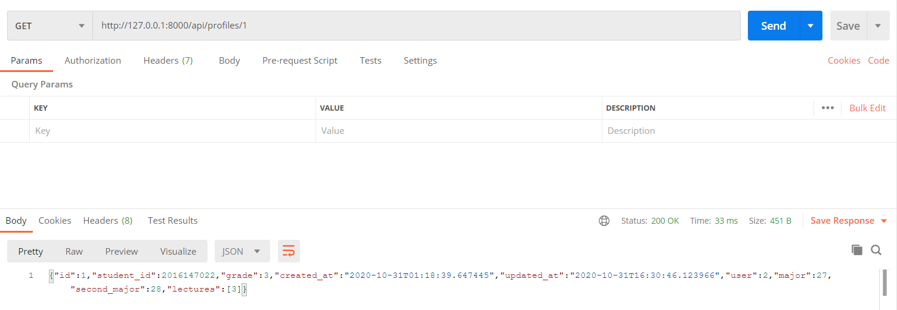

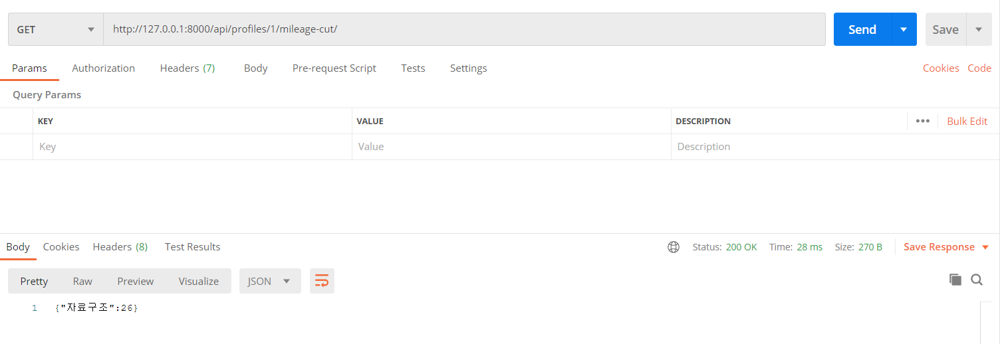


## 5주차 과제

### FilterSet
```python
class LectureFilter(FilterSet):
    name = filters.CharFilter(lookup_expr='icontains')
    professor = filters.CharFilter(method='find_by_professor')

    class Meta:
        model = Lecture
        fields = ['name', 'professor']

    def find_by_professor(self, queryset, professor, value):
        professor = Professor.objects.get(name__icontains=value)
        lectures = queryset.filter(professor=professor)
        return lectures


class LectureViewSet(viewsets.ModelViewSet):
    serializer_class = LectureSerializer
    queryset = Lecture.objects.all()
    filter_backends = [DjangoFilterBackend]
    filterset_class = LectureFilter
```

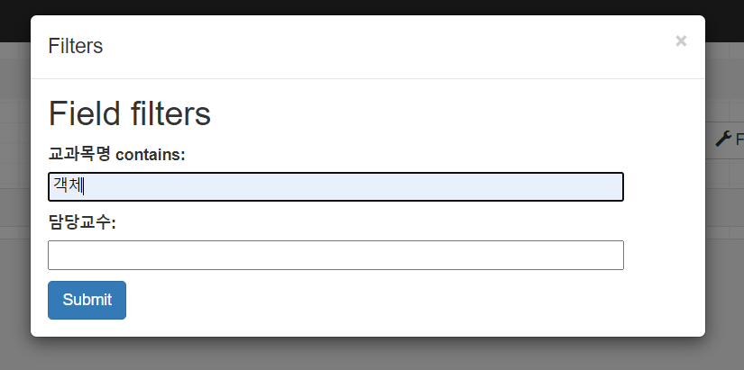
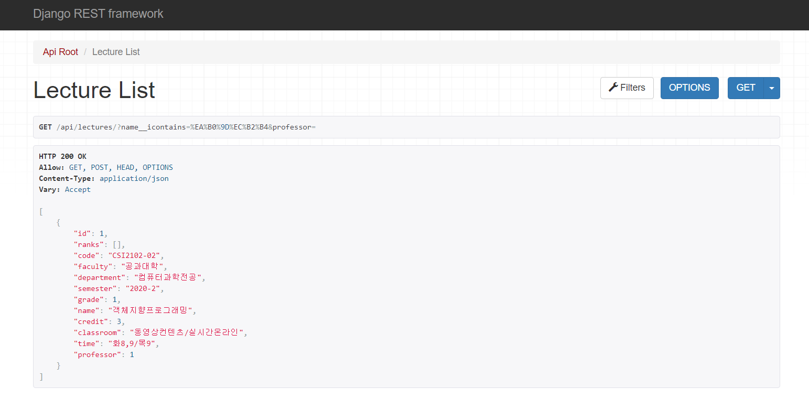
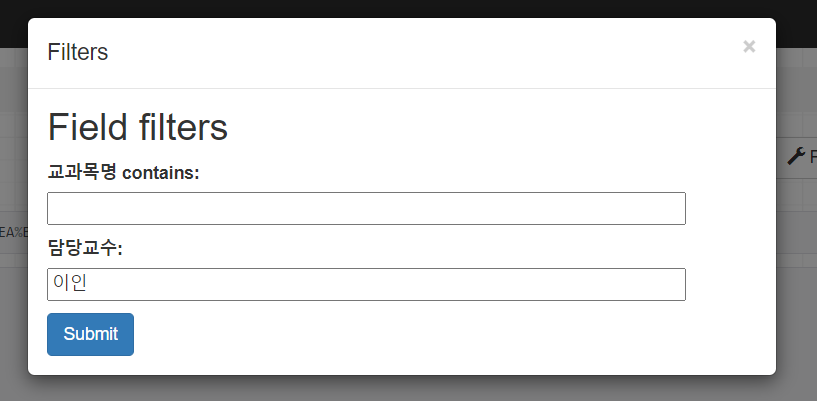
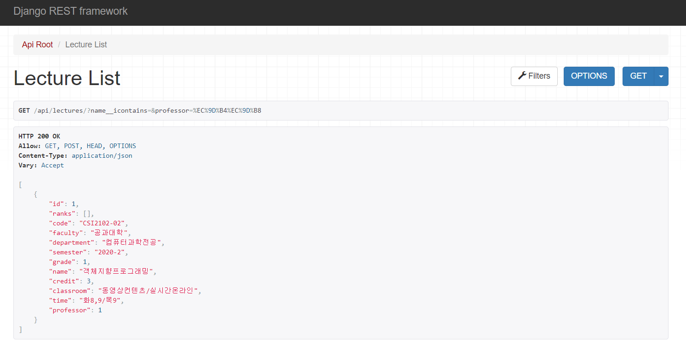

### Permission
```python
class LectureViewSet(viewsets.ModelViewSet):
    serializer_class = LectureSerializer
    queryset = Lecture.objects.all()
    filter_backends = [DjangoFilterBackend]
    filterset_class = LectureFilter
    permission_classes = (permissions.IsAuthenticatedOrReadOnly,)


class ProfileUpdatePermission(permissions.BasePermission):

    def has_object_permission(self, request, view, obj):
        if request.method in permissions.SAFE_METHODS:
            return True
        return obj.user == request.user


class ProfileViewSet(viewsets.ModelViewSet):
    serializer_class = ProfileSerializer
    queryset = Profile.objects.all()
    permission_classes = (ProfileUpdatePermission,)
```

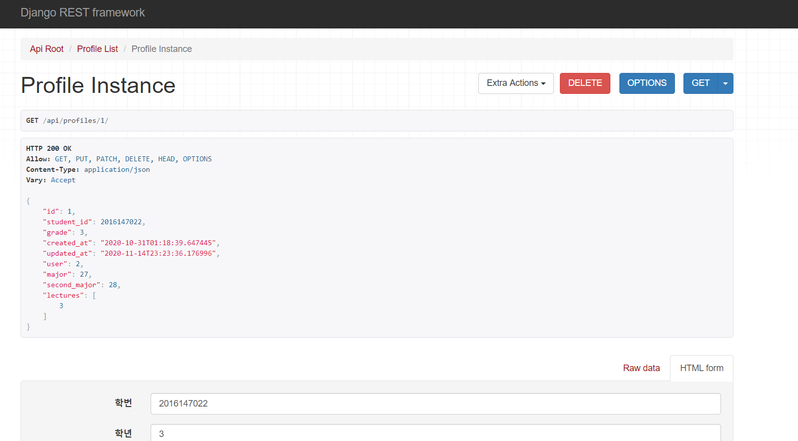
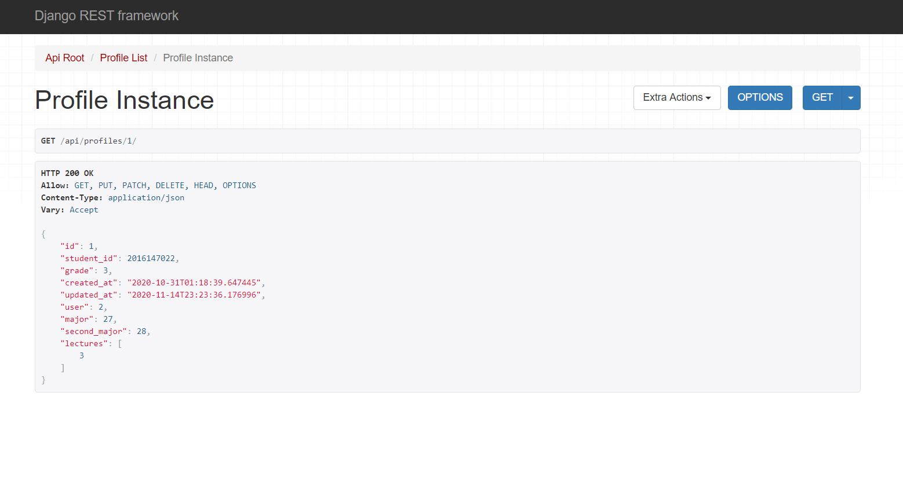

### Validation
```python
class RankSerializer(serializers.ModelSerializer):

    def validate_mileage(self, value):
        if value > 36 or value < 0:
            raise serializers.ValidationError("mileage should be non-negative integer less than 37")
        return value
    
    class Meta:
        model = Rank
        fields = '__all__'
```

### 궁금한 점
- filterset icontains로 하면 입력 창에 contains 포함돼서 나옴
- choiceFilter
- obj가 뭔지
- 인증은 어떻게 부여하는 건지
- 로그인 기능 만들 때 User 모델에 있는 정보 입력 가능한지 
- validation이랑 validator 차이가 뭔지
- validator를 field에 적용하려면 따로 정의를 해야 하는 건지(fields=all)
- 모델에서 unique=True랑 uniqueValidator랑 뭐가 다른지